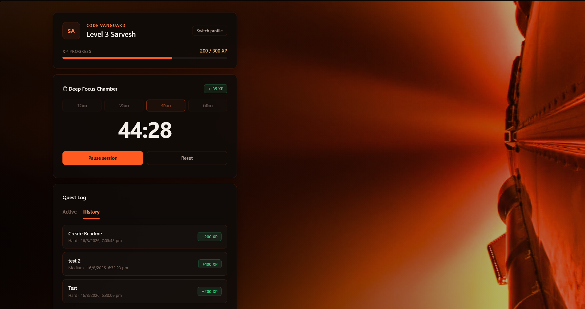
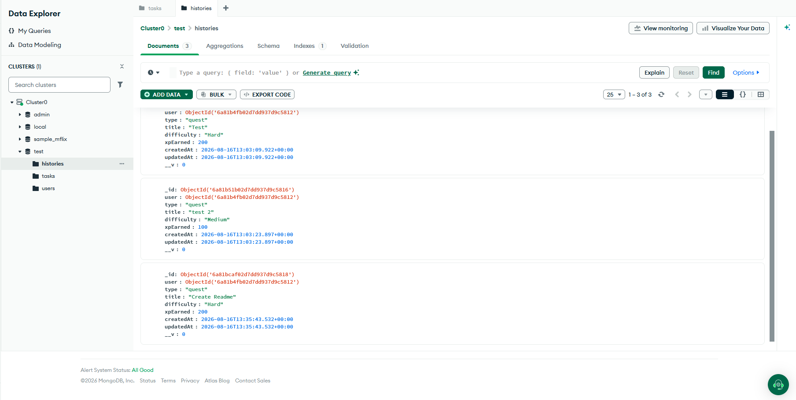

# QuestLy

A gamified study tracker. Create quests, complete them, run focus sessions, and level up — with multiple profiles and a history log of everything you've earned.

<br>

## Demo

**Profile creation**


**Main dashboard**


**Task Updation**




**MongoDB Atlas**



<br>

## Features

- **Quests** — log tasks as Easy / Medium / Hard, each worth its own XP (+50 / +100 / +200).
- **Deep Focus Chamber** — a Pomodoro-style timer with selectable session lengths (15 / 25 / 45 / 60 min), earning XP proportional to time focused.
- **Leveling** — XP accumulates toward a level threshold (`level × 100`); crossing it levels you up and rolls over any excess XP.
- **Multiple profiles** — switch between scholars from a profile picker; your last session is remembered on reload.
- **History** — every completed quest and finished focus session is logged with a timestamp and XP earned, browsable per profile.

<br>

## Tech stack

| | |
|---|---|
| **Frontend** | React (Vite), Axios |
| **Backend** | Node.js, Express |
| **Database** | MongoDB Atlas via Mongoose |
| **Styling** | Plain CSS (no framework) |

<br>

## Project structure

```
gamified-study-tracker/
├── client/
│   ├── public/
│   │   ├── assets/bg.jpg
│   │   └── 1,2,3,4          # demo images referenced in this README
│   └── src/
│       ├── api/api.js              # axios client — users, tasks, history
│       ├── App.jsx                 # profile picker + main hub
│       ├── index.css               # theme + layout
│       └── main.jsx
└── server/
    ├── config/db.js
    ├── models/
    │   ├── User.js
    │   ├── Task.js
    │   └── History.js
    ├── routes/
    │   ├── userRoutes.js
    │   ├── taskRoutes.js
    │   └── historyRoutes.js
    ├── utils/awardXp.js
    ├── .env
    └── server.js
```

<br>

## Getting started

### 1. Database

Create a free cluster on [MongoDB Atlas](https://www.mongodb.com/cloud/atlas) and grab your connection string.

### 2. Backend

```bash
cd server
npm install
```

Create `server/.env`:

```
PORT=5000
MONGO_URI=mongodb+srv://<username>:<password>@<cluster>.mongodb.net/gamified_study_tracker?retryWrites=true&w=majority
```

Run it:

```bash
npm run dev
```

Server starts at `http://localhost:5000`.

### 3. Frontend

```bash
cd client
npm install
npm run dev
```

App starts at `http://localhost:5173`.

<br>

## API reference

Base URL: `http://localhost:5000/api`

| Method | Endpoint | Description |
|---|---|---|
| `GET` | `/users` | List all profiles |
| `POST` | `/users` | Create a profile — `{ username }` |
| `GET` | `/users/:id` | Fetch a single profile |
| `GET` | `/tasks/:userId` | List active (incomplete) quests for a profile |
| `POST` | `/tasks` | Create a quest — `{ title, difficulty, userId }` |
| `POST` | `/tasks/:id/complete` | Complete a quest, award XP — `{ userId }` |
| `DELETE` | `/tasks/:id` | Delete a quest |
| `POST` | `/tasks/bonus-xp` | Award XP for a finished focus session — `{ userId, minutes }` |
| `GET` | `/history/:userId` | List the 50 most recent completed quests/sessions |

<br>

## Notes

- XP thresholds scale per level: leveling from `N` to `N+1` requires `N × 100` XP.
- Focus sessions award XP at a fixed rate of 3 XP per minute (a 25-minute session nets +75 XP).
