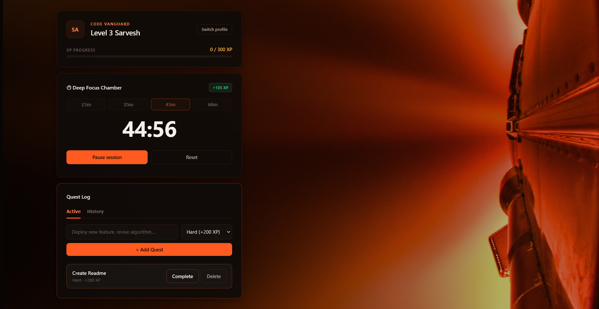

# QuestLy ⚔️

A gamified study tracker and productivity chamber. Create quests, complete them, run focus sessions, and level up — with multiple profiles and a history log of everything you've earned.

[](https://www.docker.com/)
[](https://docs.docker.com/compose/)
[](https://react.dev/)
[](https://nodejs.org/)
[](https://www.mongodb.com/)

---

## 🗺️ Project Roadmap & Versions

* 🚀 **V2 (Current — Recommended):** **Dockerized Architecture**. Entire stack containerized with multi-container internal networking, local persistent MongoDB storage, a browser-based Mongo Express GUI (`:8081`), and live hot-reloading.
* 📁 **[V1 (Legacy Manual Release)](./v1):** Original manual web version (Vite React + Express + MongoDB Atlas). Archived in [`v1/`](./v1).
* 🔮 **V3 (Upcoming Milestone):** Standalone Native Desktop App (`.exe` with embedded zero-dependency local database).

---

## 🎮 Features

- **Quests** — log tasks as Easy / Medium / Hard, each worth its own XP (+50 / +100 / +200).
- **Deep Focus Chamber** — a Pomodoro-style timer with selectable session lengths (15 / 25 / 45 / 60 min), earning XP proportional to time focused.
- **Leveling** — XP accumulates toward a level threshold (`level × 100`); crossing it levels you up and rolls over any excess XP.
- **Multiple Profiles** — switch between scholars with ease; your active profile is remembered across sessions.
- **History Log** — every completed quest and finished focus session is logged with a timestamp and XP earned.

### 📸 Demo (V2)

**Profile creation**


**Main dashboard**



**Task Updation**


---

## 🛠️ Tech Stack (V2)

### Frontend
<p>
  
</p>

### Backend & Database
<p>
  
</p>

### DevOps & Containers
<p>
  
</p>

### Tools
<p>
  
</p>

| Layer | Technology (V2) |
|---|---|
| **Frontend** | React 19, Vite, Axios |
| **Backend** | Node.js 20, Express |
| **Database** | MongoDB 7.0 (Local Container Engine) |
| **Database GUI** | Mongo Express 1.0.2 (Web Admin at `:8081`) |
| **Containerization** | Docker, Docker Compose |
| **Styling** | Plain CSS |

---

## 📂 Project Structure

```
QuestLy/
├── docker-compose.yml           # Master orchestrator for MongoDB, GUI, API, and Frontend
├── README.md                    # Main documentation
├── v2/                          # V2 Dockerized Full-Stack
│   ├── docker-compose.dev.yml   # Standalone V2 development compose
│   ├── README.md                # V2 In-depth Docker learning roadmap
│   ├── server/                  # Express REST API
│   │   ├── Dockerfile           # Backend container recipe
│   │   ├── config/db.js         # Auto-reconnect retry logic for Docker MongoDB
│   │   ├── models/              # User, Task, History schemas
│   │   ├── routes/              # userRoutes, taskRoutes, historyRoutes
│   │   └── server.js
│   └── client/                  # Vite + React Gamified Dashboard
│       ├── Dockerfile           # Frontend container recipe
│       ├── vite.config.js       # Host 0.0.0.0 + polling watches + /api proxy
│       └── src/
└── v1/                          # Legacy manual setup (archived)
    ├── server/                  # Original Express + Atlas backend
    └── client/                  # Original Vite React client
```

---

## 📜 API Reference

Base URL: `http://localhost:5000/api` (or relative `/api` via Vite dev server)

| Method | Endpoint | Description |
|---|---|---|
| `GET` | `/health` | Diagnostic probe verifying server uptime |
| `GET` | `/users` | List all scholar profiles |
| `POST` | `/users` | Create a profile — `{ username }` |
| `GET` | `/users/:id` | Fetch a single profile |
| `GET` | `/tasks/:userId` | List active (incomplete) quests for a scholar |
| `POST` | `/tasks` | Create a quest — `{ title, difficulty, userId }` |
| `POST` | `/tasks/:id/complete` | Complete a quest, award XP — `{ userId }` |
| `DELETE` | `/tasks/:id` | Delete a quest |
| `POST` | `/tasks/bonus-xp` | Award XP for a finished focus session — `{ userId, minutes }` |
| `GET` | `/history/:userId` | List recent completed quests and sessions |

---

## 📦 Legacy Version (V1)

If you wish to run the older manual web version with MongoDB Atlas without Docker, refer to the [**v1/ README.md**](./v1/README.md).

---

## 📄 License
This project is open source and available under the [MIT License](LICENSE).
